<!-- START doctoc generated TOC please keep comment here to allow auto update -->
<!-- DON'T EDIT THIS SECTION, INSTEAD RE-RUN doctoc TO UPDATE -->
**Table of Contents**  *generated with [DocToc](https://github.com/thlorenz/doctoc)*

- [Deploying CP4WAIOps Demo Environments Using GitOps In One Click](#deploying-cp4waiops-demo-environments-using-gitops-in-one-click)
  - [Prepare Environment](#prepare-environment)
  - [Install CP4WAIOps](#install-cp4waiops)
    - [Installation Parameters](#installation-parameters)
  - [Access Environment](#access-environment)
    - [CP4WAIOps](#cp4waiops)
    - [Robot Shop](#robot-shop)
    - [Humio](#humio)

<!-- END doctoc generated TOC please keep comment here to allow auto update -->

# Deploy CP4WAIOps Demo Environment Using GitOps In One Click


This tutorial will work you through the extremely easy steps to deploy demo environment for Cloud Pak for Watson AIOps (CP4WAIOps) using GitOps. It allows you to:

- Deploy CP4WAIOps using custom profile, e.g.: extremely small profile in a sandbox with restricted resource.
- Auto-configure integration with Humio, Kafka, Kubernetes, etc. as post-install step.
- Deploy Robot Shop as sample application and other dependencies on the same cluster where CP4WAIOps runs.

Althouth in this tutorial, I will use the extremely small profile to demonstrate the installation of CP4WAIOps, sample application, and dependencies, which is targeted for demo or PoC deployment rather than production deployment, the same idea can be applied to CP4WAIOps installation in production environment as well.

This approach has been tested and verfied on CP4WAIOps 3.2.

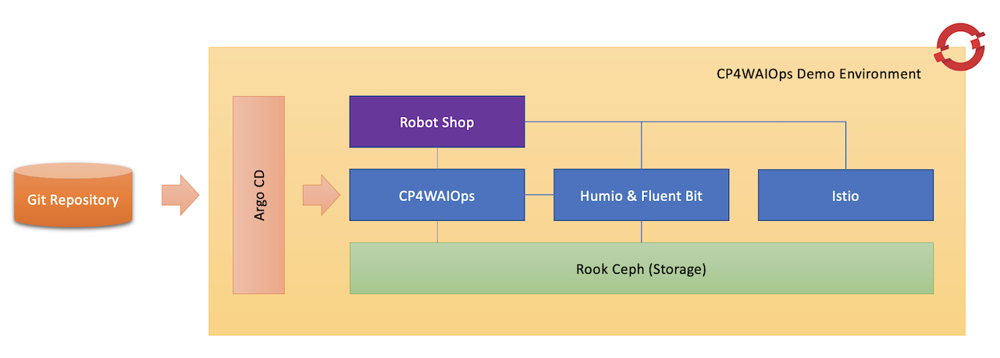

## Prepare Environment

Prepare an OpenShift cluster as your demo environment. If you use the extremely small profile, i.e.: the `x-small` profile, it is recommended to setup a cluster with 3 worker nodes where each node has 16 core CPU and 32GB memory. We will use this cluster to install below applications:

| Application        | Required | Description
| ------------------ | -------- | -------------------------------------------------------------------
| Argo CD            | Yes      | The GitOps engine that drives the whole installation under the hood.
| Rook Ceph          | No       | The storage used by CP4WAIOps and other applications. It can be skipped if you already have storage provisioned.
| CP4WAIOps          | No       | Cloud Pak for Watson AIOps.
| Robot Shop         | No       | The sample application used to demonstrate CP4WAIOps features.
| Humio & Fluent Bit | No       | The log collector used by CP4WAIOps.
| Istio              | No       | The service mesh used by sample application for fault injection.

To deploy Argo CD, log on cluster via OpenShift console, navigate to `Operators` -> `OperatorHub`, search for `OpenShift GitOps`, then install using default settings.

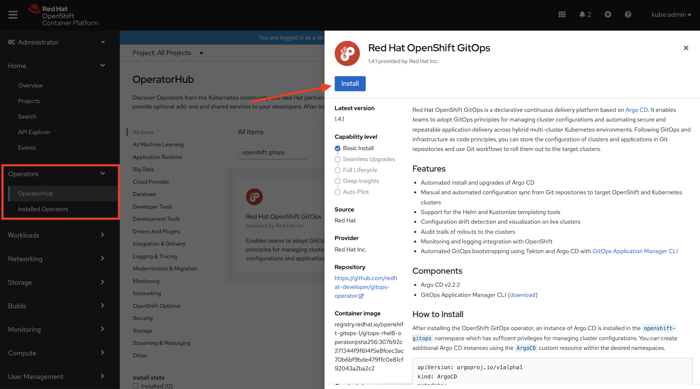

After it's finished, navigate to Argo CD UI by clicking `Cluster Argo CD` from the drop down menu on top right of OpenShift Console:

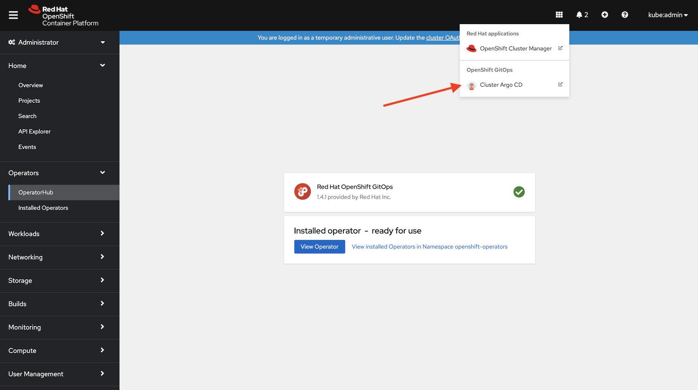

Choose `Log in via OpenShift` on login page:

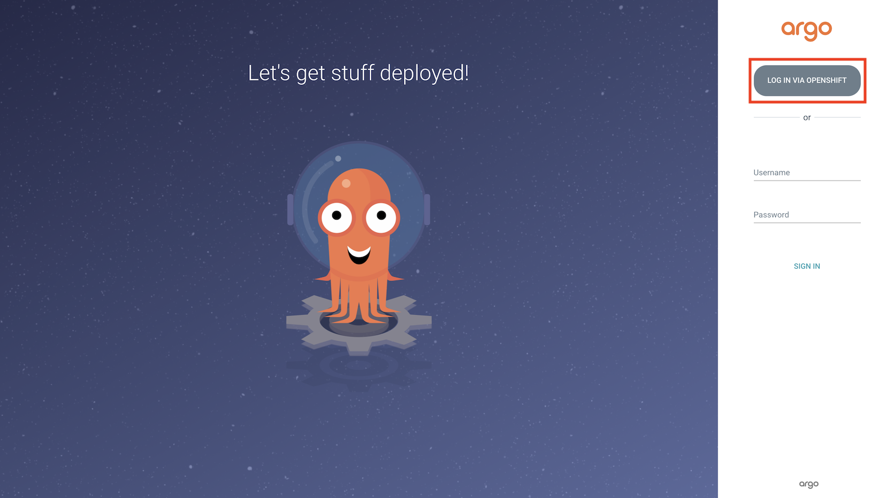

Then choose `Allow selected permissions` on authorize access page:

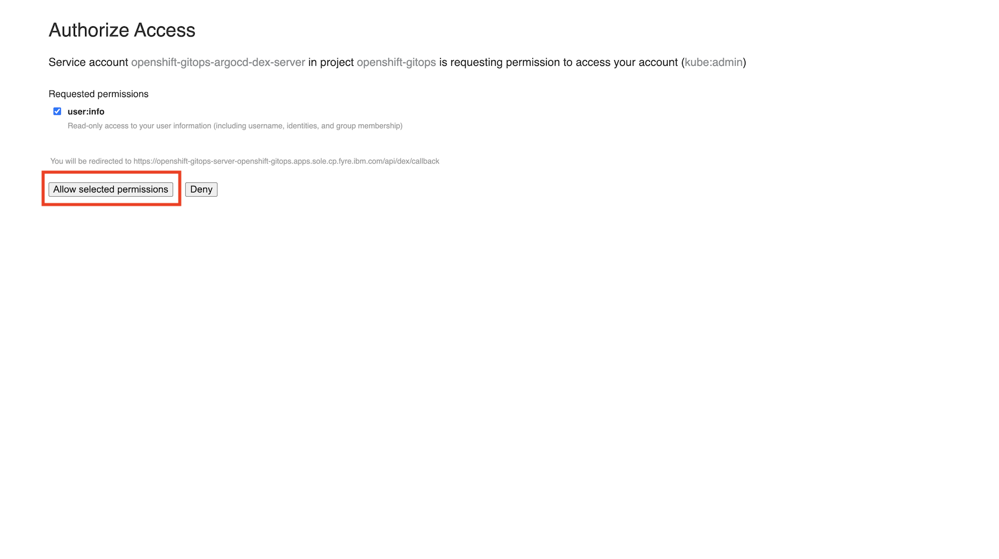

## Install CP4WAIOps

After login to Argo CD, you should be able to kick off the installation by clicking the "NEW APP" button on top left to create an Argo Application as below:

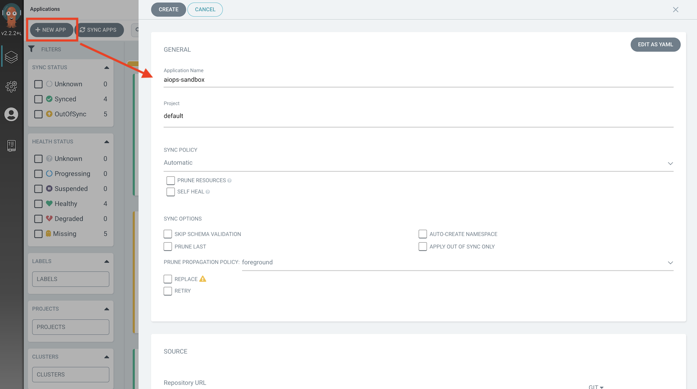

Just fill in the form using the suggested field values listed in below table:

| Field                 | Value                                                 |
| --------------------- | ----------------------------------------------------- |
| Application Name      | cp4waiops-demo                                        |
| Project               | default                                               |
| Sync Policy           | Automatic                                             |
| Repository URL        | https://github.com/morningspace/cp4waiops-sandbox     |
| Revision              | HEAD                                                  |
| Path                  | config/all-in-one                                     |
| Cluster URL           | https://kubernetes.default.svc                        |
| Namespace             | openshift-gitops                                      |

### Installation Parameters

Besides the basic information that you input, it also allows you to change the installation parameters as below to customize the installation behavior.

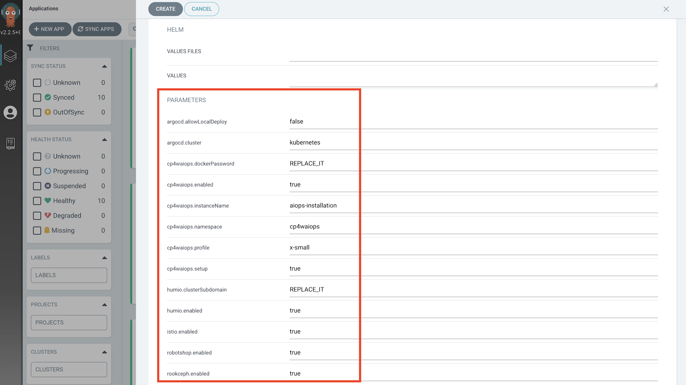

Below table summarizes the detailed meaning for each parameter:

| Parameter                 | Type   | Default Value      | Description 
| ------------------------- |--------|--------------------|-----------------------------------
| argocd.cluster            | string | openshift          | The type of the cluster that Argo CD runs on, valid values: kubernetes, openshift.
| argocd.allowLocalDeploy   | bool   | true               | Allow applications to be deployed on the same cluster where Argo CD runs.
| cp4waiops.enabled         | bool   | true               | Specify whether or not to install CP4WAIOps.
| cp4waiops.instanceName    | string | aiops-installation | The instance name of CP4WAIOps.
| cp4waiops.namespace       | string | cp4waiops          | The namespace of CP4WAIOps.
| cp4waiops.profile         | string | x-small            | The CP4WAIOps deployment profile, e.g.: x-small, small, large.
| cp4waiops.dockerPassword  | string | n/a                | The password of image registry used to pull CP4WAIOps images. If you install the official CP4WAIOps release, please find your password from [here].
| cp4waiops.setup           | bool   | true               | Specify whether or not to setup CP4WAIOps with sample integrations, e.g.: Humio, Kafka, Kubernetes, etc. after it is installed.
| robotshop.enabled         | bool   | true               | Specify whether or not to install Robotshop.
| humio.enabled             | bool   | true               | Specify whether or not to install Humio. 
| istio.enabled             | bool   | true               | Specify whether or not to install Istio.
| rookceph.enabled          | bool   | true               | Specify whether or not to install Rook Ceph as storage used by CP4WAIOps.

[here]: https://myibm.ibm.com/products-services/containerlibrary

After you finish filling up the form, just click the "CREATE" button to kick off the installation, then you are done!

Now you can work around, grab some coffee, and wait for the installation to complete. During the time, you will notice a few more argo applications being rolled out gradually from Argo CD UI. Each application represents a specific application to be deployed which is managed by the root level application defined by you as above.

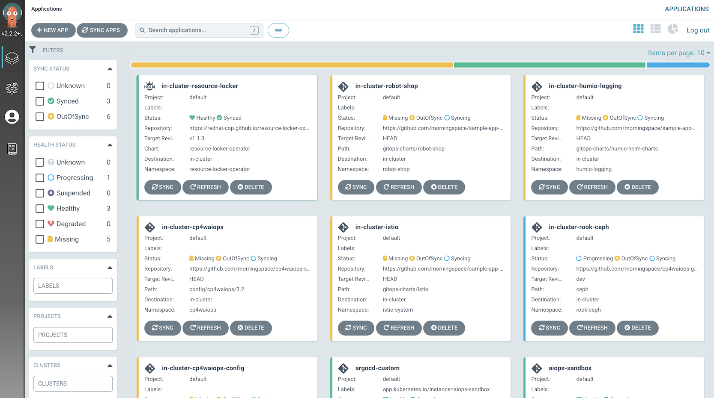

Depends on the installation parameters that you specified, it usually takes 1 hour to finish the installation of CP4WAIOps, and 10 minutes to finish all the other applications deployment including Rook Ceph, Robot Shop, Humio, Istio, etc. When you see all the applications turn into green, i.e.: `Synced` and `Healthy`, that means CP4WAIOps install is completed!

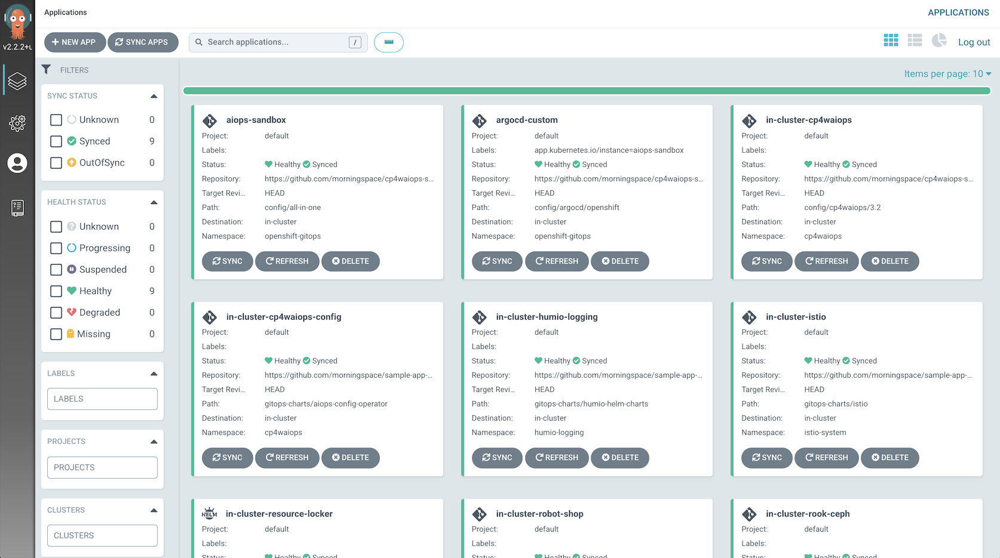

## Access Environment

### CP4WAIOps

To access CP4WAIOps, you can run below command to get the URL. Here `aiops-installation` is the CP4WAIOps instance name that you specified via the installation parameter `cp4waiops.instanceName` in above step.

```sh
kubectl -n cp4waiops get installation aiops-installation -o jsonpath='{.status.locations.cloudPakUiUrl}{"\n"}'
```

Run below command to get the password for user `admin`:

```sh
kubectl -n ibm-common-services get secret platform-auth-idp-credentials -o jsonpath='{.data.admin_password}' | base64 -d
```

Then use these information to login CP4WAIOps UI:

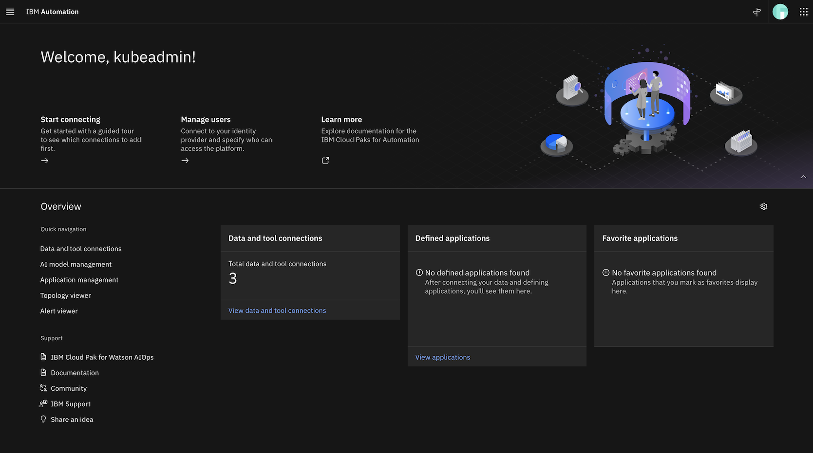

If you set the installation parameter `cp4waiops.setup` to `true`, then you will have all the pre-configured integration with Humio, Kafka, and Kubernetes in place. To verify this, navigate to `define` -> `Data and tool connections` after you login, you can see all the integrations created as below:

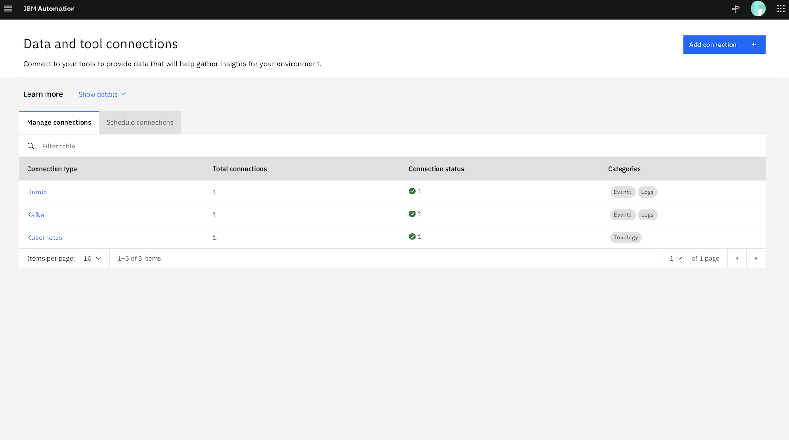

### Robot Shop

To access Robot Shop, you can run below command to get the URL:

```sh
kubectl -n istio-system get route istio-ingressgateway -o jsonpath='{"http://"}{.spec.host}{"\n"}'
```


### Humio

To access Humio, you can run below command to get the URL:

```sh
kubectl -n humio-logging get route humio-humio-core -o jsonpath='{"http://"}{.spec.host}{"\n"}'
```

Run below command to get the password for user `developer`:

```sh
kubectl -n humio-logging get secret developer-user-password -o jsonpath="{.data.password}" | base64 -d
```

After login to Humio UI, you will see the pre-defined repo named `robot-shop` for Robot Shop sample application:

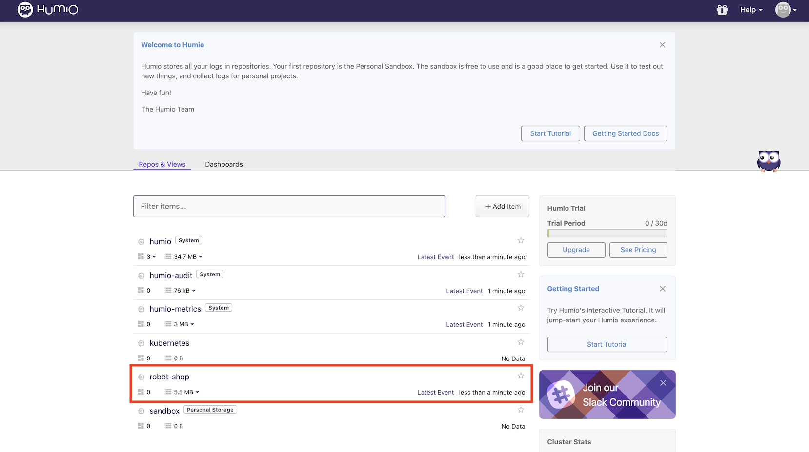

Click the repo, you will see the live logs captured by Humio from Robot Shop:

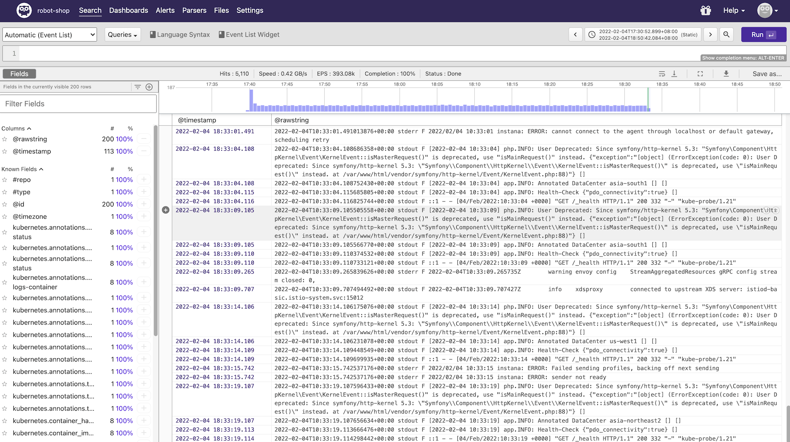

Enjoy yourself!
