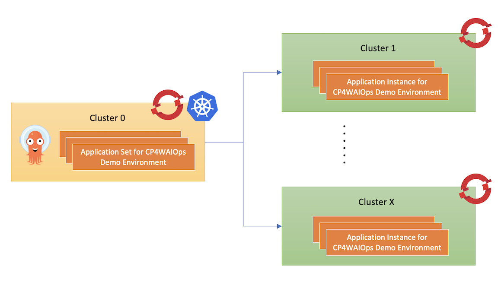
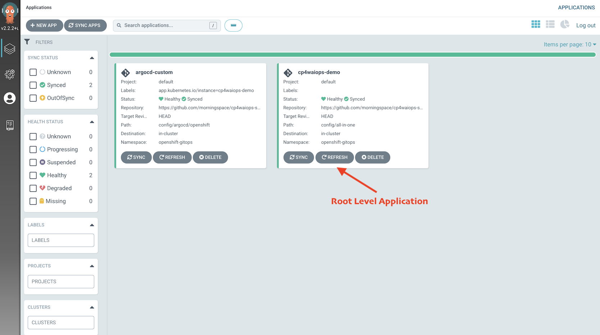
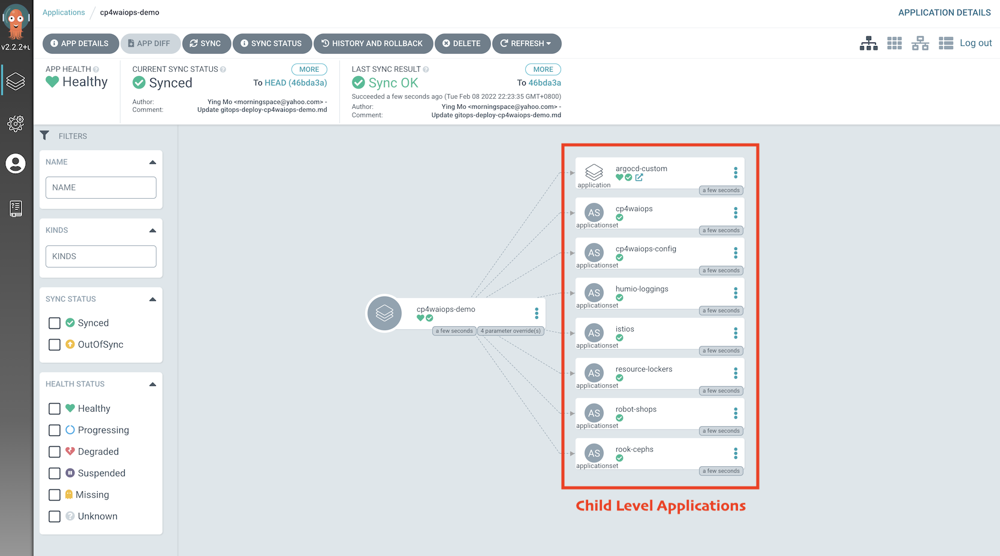
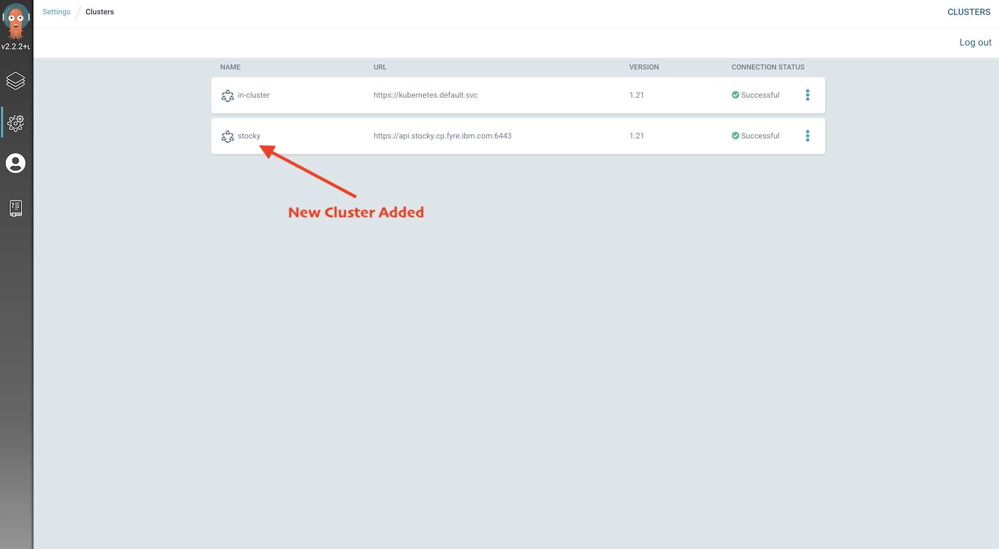
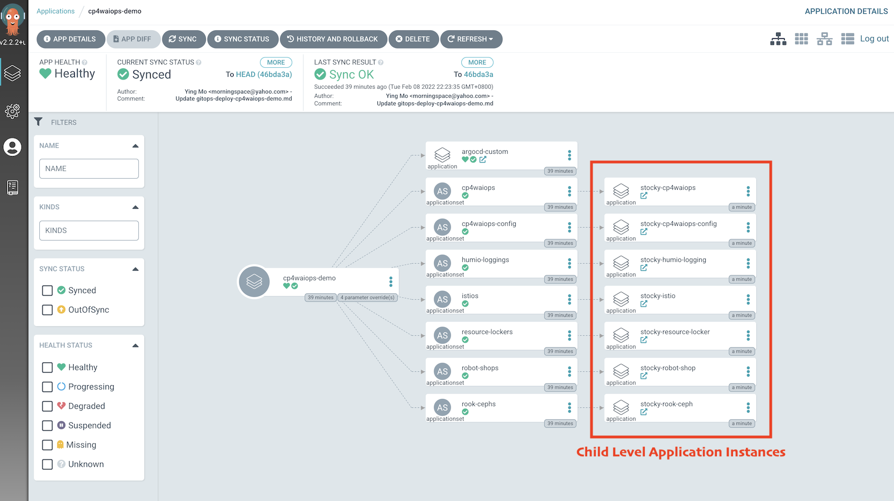
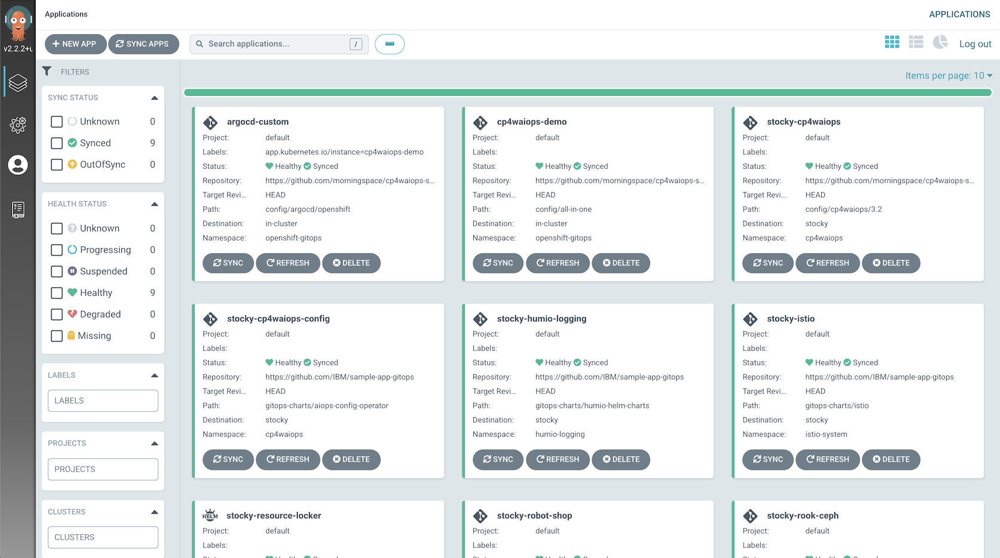
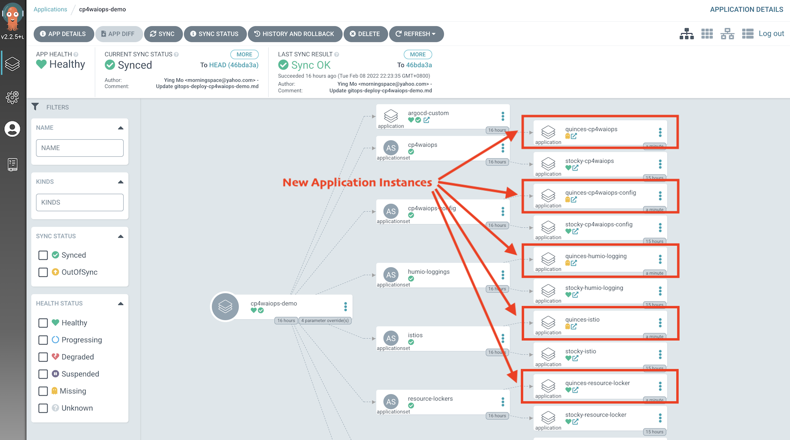

<!-- START doctoc generated TOC please keep comment here to allow auto update -->
<!-- DON'T EDIT THIS SECTION, INSTEAD RE-RUN doctoc TO UPDATE -->
**Table of Contents**  *generated with [DocToc](https://github.com/thlorenz/doctoc)*

- [Deploy CP4WAIOps Demo Environment To Multiple Clusters At Scale Using GitOps](#deploy-cp4waiops-demo-environment-to-multiple-clusters-at-scale-using-gitops)
  - [Prepare Environments](#prepare-environments)
  - [Install Argo CD And argocd CLI](#install-argo-cd-and-argocd-cli)
  - [Install CP4WAIOps](#install-cp4waiops)
  - [Add Cluster Into Argo CD](#add-cluster-into-argo-cd)
  - [Add More Clusters](#add-more-clusters)

<!-- END doctoc generated TOC please keep comment here to allow auto update -->

# Deploy CP4WAIOps Demo Environment To Multiple Clusters At Scale Using GitOps

This tutorial will work you through the steps to deploy the same demo environment for Cloud Pak for Watson AIOps (CP4WAIOps) to multiple clusters using GitOps. You will see that to deploy CP4WAOps, sample application, and other dependencies to multiple clusters is extremely easy.

For how to deploy CP4WAIOps demo environment on a single cluster using GitOps, please refer to [this document](gitops-deploy-cp4waiops-demo.md).

## Prepare Environments

You need at least one cluster to host Argo CD, then one or more clusters to deploy the CP4WAIOps demo environment. As it is illustrated in below diagram:

* `cluster 0` is used to host the Argo CD instance. It can be an OpenShift or a vanilla Kubernetes cluster which does not require too much resource since Argo CD is a very lightweight application and support both OpenShift and vanilla Kubernetes.

* `cluster 1` to `cluster X` are used to deploy the CP4WAIOps demo environments. If you are looking for an extremely small CP4WAIOps deployment with all the default components, sample application, and other dependencies run on the same cluster for demo or PoC purpose, it is recommended to prepare cluster with 3 worker nodes where each node has 16 core CPU and 32GB memory. If you are looking for production deployment, please refer to the hardware requirement details in the official [product document](https://www.ibm.com/docs/en/cloud-paks/cloud-pak-watson-aiops/3.2.0?topic=requirements-ai-manager).



## Install Argo CD And argocd CLI

On the cluster that hosts Argo CD, let's install Argo CD first. If you use OpenShift cluster to host Argo CD, please refer to the `Install Argo CD` section in [this document](gitops-deploy-cp4waiops-demo.md). If you use vanilla Kubernetes cluster to host Argo CD, please refer to the [Argo CD online document](https://argo-cd.readthedocs.io/en/stable/getting_started/) for Argo CD installation instructions.

In this tutorial, we will also use argocd CLI to add clusters to Argo CD so that Argo CD can deploy the CP4WAIOps demo environment to those clusters. To install argocd CLI, please refer to the [Argo CD online document](https://argo-cd.readthedocs.io/en/stable/cli_installation/). You can install and run argocd CLI on any machine such as your notebook, since it is just a client tool used to connect to Argo CD server.

## Install CP4WAIOps

After you finish the Argo CD and argocd CLI install, let's deploy CP4WAIOps via Argo CD UI. To install CP4WAIOps, please refer to the `Install CP4WAIOps` section in [this document](gitops-deploy-cp4waiops-demo.md). We use the same field values described in that document when filling up the form to create the Argo Application.

The only difference is, when you set the installation parameter `argocd.allowLocalDeploy`, make sure it is `false`. This is to avoid the CP4WAIOps demo environment from being deployed on the same cluster where Argo CD runs, since in this tutorial, we use that cluster to run Argo CD dedicately.

After you create the Argo Application, you will see something similar as below from Argo CD UI:



You will only see the root level Argo Application is listed. There is no other child level Applications created for now. This is because we have not added any other cluters into Argo CD to deploy the actual CP4WAIOps demo environments yet. But if you click the root level application and go into it, you will see all the child level application definitions are listed as below:



Depends on the installation parameters that you specified when you create the root level Argo Application, you can enable or disable some of the applications according to your specific needs. In the above case, I enabled all applications that are available, e.g.: CP4WAIOps, Robot Shop, Humio, Istio, etc. They will be deployed to target cluster that is going to be added into Argo CD later in this tutorial.

## Add Cluster Into Argo CD

Let's add our first cluster into Argo CD. Suppose you use OpenShift cluster to host Argo CD, you need to login to the cluster first using `oc login` command, then run below command to login to Argo CD using argocd CLI:

```sh
ARGO_HOST=$(oc get route openshift-gitops-server -n openshift-gitops -o jsonpath='{.spec.host}')
ARGO_PASSWORD=$(oc get secret openshift-gitops-cluster -n openshift-gitops -o "jsonpath={.data['admin\.password']}" | base64 -d)
argocd login --username admin --password $ARGO_PASSWORD $ARGO_HOST --insecure
```

Next, login to the target cluster that will be used to deploy the CP4WAIOps demo environment, again using `oc login` command. Then, run below command to add that cluster into Argo CD using argocd CLI:

```sh
CLUSTER_NAME=stocky
CURRENT_CONTEXT=$(oc config current-context)
argocd cluster add $CURRENT_CONTEXT --name $CLUSTER_NAME
```

Here, let's give the cluster a short name using `CLUSTER_NAME` and pass it into argocd CLI via argument `--name`.

Now, go to `Settings` -> `Clusters` from Argo CD UI, you will see the newly added cluster is listed as below:



If you go to `Applications`, all of a sudden, you will see all the child level applications are getting created and that all happens automatically without any additional manual intervention.


If you click the root level application and go into it, you will see for each child level application definition, there is a corresponding application instance linked to it and that is the actual workload being deployed to the target cluster that we added into Argo CD just now.



Depends on the installation parameters that you specified when creating the root level application, it usually takes 1 hour to finish the installation of CP4WAIOps, and 10 minutes to finish all the other applications deployment including Rook Ceph, Robot Shop, Humio, Istio, etc. When you see all the applications turn into green, i.e.: `Synced` and `Healthy`, that means the CP4WAIOps demo environment install is completed on the target cluster!



## Add More Clusters

To add more clusters to deploy more CP4WAIOps demo environments is quite easy. Just repeat the above step to add clusters into Argo CD. Once detected, Argo CD will deploy applications to these clusters automatically. As an example, after you add the second cluster, you will see the newly added cluster will be added to the `Clusters` view from Argo CD UI:


You will also see each child level application definition now maps to two application instances and each instance represents the actual workload being deployed to a separate cluster.


